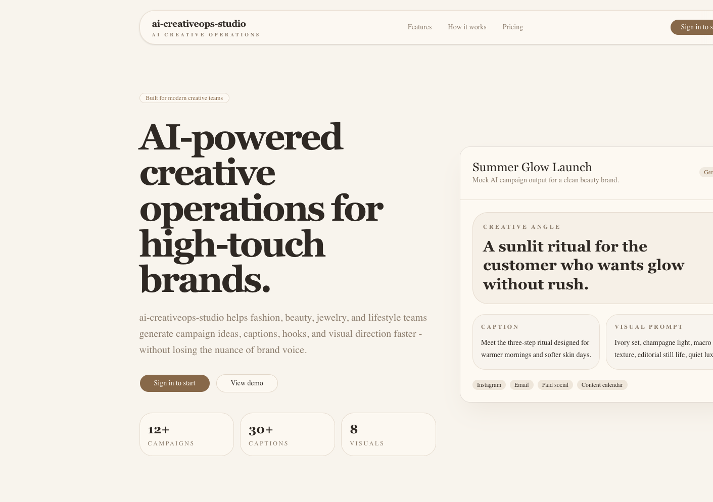
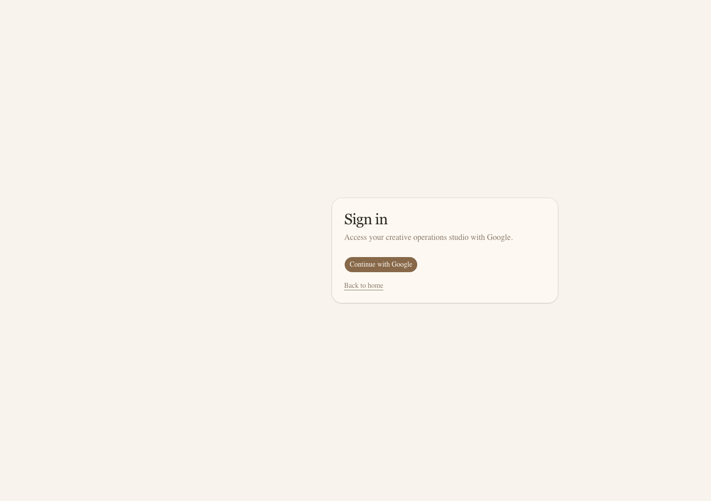
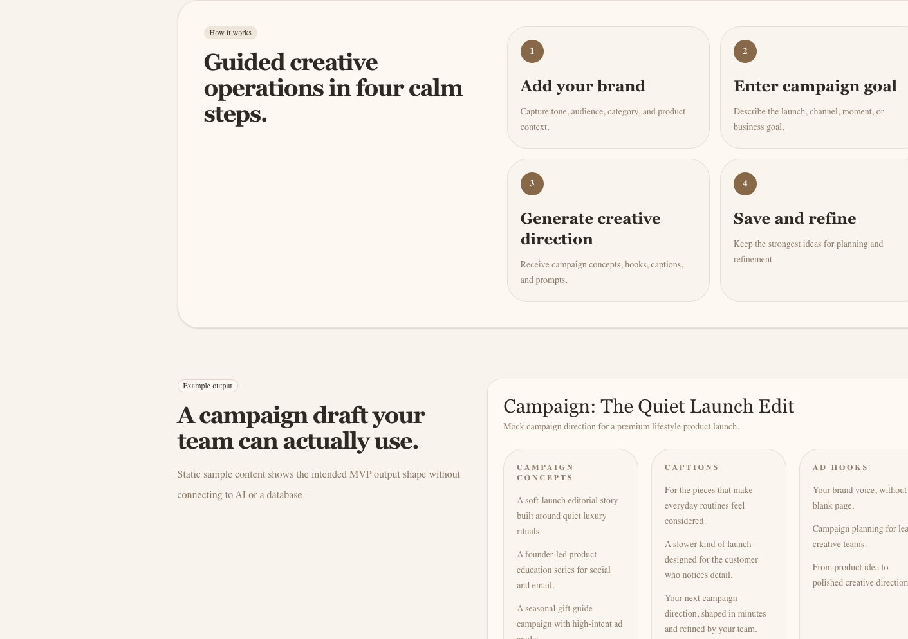
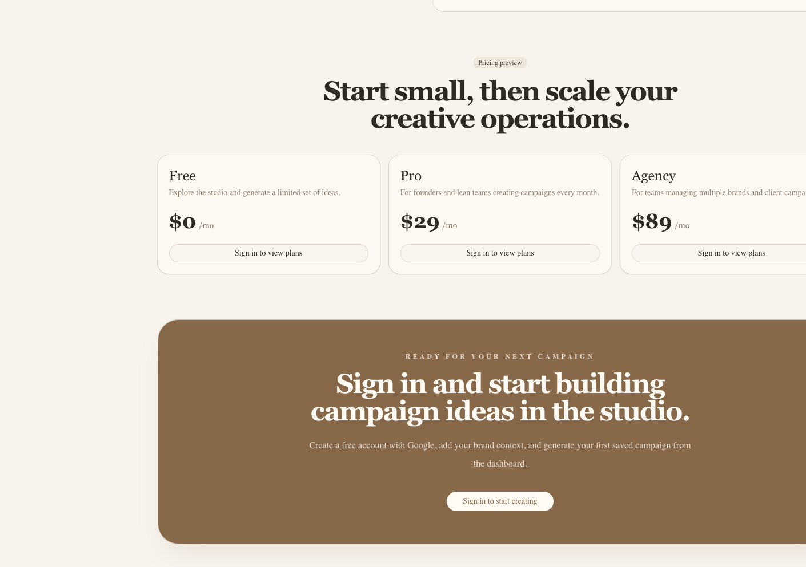
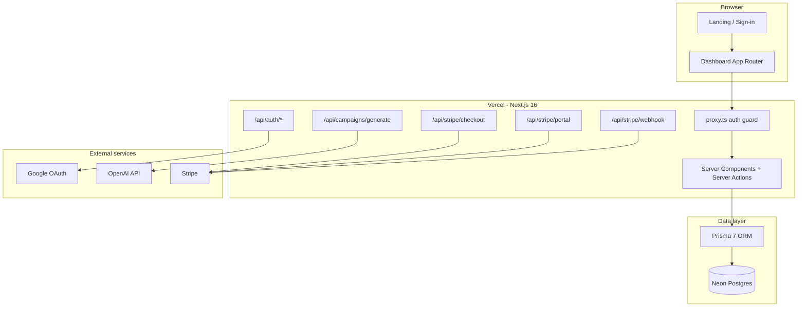
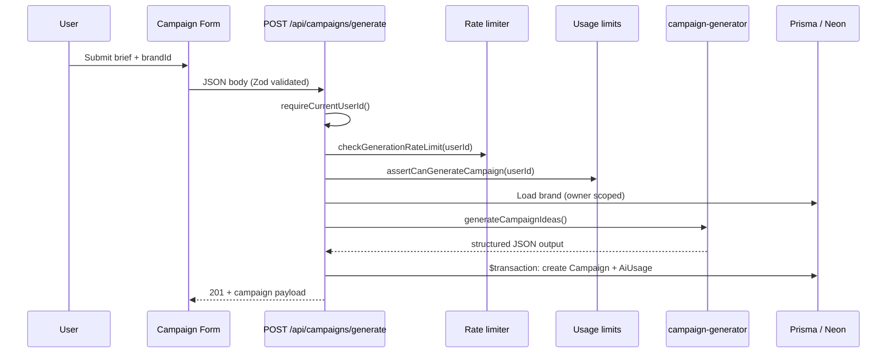

# ai-creativeops-studio

Production-style SaaS MVP for AI-powered creative operations — brand profiles, campaign generation, usage metering, and Stripe subscriptions.

**Live:** https://ai-creativeops-studio-1.vercel.app  
**Repo:** https://github.com/jimech/ai-creativeops-studio

---

## Project status

| Area | Status |
|------|--------|
| Google OAuth (Auth.js v5) | ✅ |
| Brand CRUD + ownership scoping | ✅ |
| AI campaign generation (OpenAI + mock mode) | ✅ |
| Campaign library + detail pages | ✅ |
| Monthly AI usage limits by plan | ✅ |
| Stripe Checkout + Customer Portal | ✅ |
| Stripe webhook subscription sync | ✅ |
| Security headers + env validation | ✅ |
| Vercel deployment + `.vercelignore` | ✅ |
| Production env vars in Vercel Dashboard | ⚠️ Configure before go-live |
| Google OAuth production redirect | ⚠️ Add in Google Cloud Console |
| Stripe production webhook | ⚠️ Register endpoint in Stripe Dashboard |

See [DEPLOYMENT_CHECKLIST.md](./DEPLOYMENT_CHECKLIST.md) for the full production rollout checklist.

---

## Screenshots

Captured from production (`https://ai-creativeops-studio-1.vercel.app`).

### Landing page



Marketing homepage with product positioning, sample campaign card, and sign-in CTAs.

### Sign in



Google OAuth entry point. All `/dashboard/*` routes are protected by Auth.js middleware (`proxy.ts`).

### How it works



Four-step workflow and static sample output shape (concepts, captions, hooks).

### Pricing preview



Free / Pro / Agency tiers aligned with `SubscriptionPlan` enum and Stripe Price IDs.

> **Note:** Dashboard, campaign generator, and billing screens require authentication. Sign in locally or on production to capture those screenshots.

---

## Architecture



### Request flow: campaign generation



---

## Tech stack

| Layer | Technology |
|-------|------------|
| Framework | Next.js 16 (App Router, Turbopack dev) |
| Language | TypeScript 5 |
| UI | React 19, Tailwind CSS 4, shadcn/ui, Radix |
| Auth | Auth.js v5 (`next-auth`) + Google provider + Prisma adapter |
| Database | Neon Postgres + Prisma 7 (`@prisma/adapter-pg`) |
| AI | OpenAI SDK (`gpt-4o-mini`), Zod-validated JSON output |
| Billing | Stripe Checkout, Customer Portal, webhooks |
| Hosting | Vercel |

---

## Repository layout

```
app/
  page.tsx                    # Marketing homepage
  sign-in/page.tsx            # Google OAuth entry
  dashboard/                  # Authenticated shell + feature pages
    brands/                   # Brand list, create, edit
    campaigns/                # Library, generator, detail
    billing/                  # Plan status, checkout, portal
    assets/                   # Placeholder
    settings/                 # Placeholder
  api/
    auth/[...nextauth]/       # Auth.js handlers
    campaigns/generate/       # AI generation + persistence
    stripe/checkout/          # Checkout session creation
    stripe/portal/            # Billing portal session
    stripe/webhook/           # Subscription sync

auth.ts                       # Auth.js config + authorized callback
proxy.ts                      # Middleware matcher for /dashboard/*
lib/
  ai/campaign-generator.ts    # OpenAI + mock generation
  billing/usage-limits.ts     # Plan limits + monthly window
  auth/authorization.ts       # getCurrentUserId, ownership helpers
  env.ts                      # Server-side env validation
  stripe/                     # Stripe client + subscription sync
  rate-limit.ts               # In-memory per-user generation throttle
prisma/
  schema.prisma               # MVP data model
  migrations/                 # Checked-in SQL migrations
components/
  dashboard/dashboard-shell.tsx
  forms/                      # Brand + campaign forms
  billing/                    # Checkout + portal buttons
```

---

## Data model

Prisma schema (`prisma/schema.prisma`):

| Model | Purpose |
|-------|---------|
| `User` | OAuth user, `stripeCustomerId` |
| `Account` / `Session` | Auth.js adapter tables |
| `Brand` | Owner-scoped brand profile (tone, industry, colors, fonts) |
| `Campaign` | Saved generation; `aiOutput` stored as `Json` |
| `Subscription` | Plan (`FREE` / `PRO` / `AGENCY`) + Stripe subscription id |
| `AiUsage` | Per-generation audit log (`GENERATE_CAMPAIGN`, etc.) |
| `Asset` | Brand file metadata (R2-ready schema) |

**Ownership rule:** all reads/writes scope through `brand.ownerId === session.user.id`. Missing or foreign resources return `notFound()` — no existence leakage.

---

## API surface

| Method | Route | Auth | Description |
|--------|-------|------|-------------|
| `*` | `/api/auth/*` | Public | Auth.js OAuth + session |
| `POST` | `/api/campaigns/generate` | Required | Generate + save campaign |
| `POST` | `/api/stripe/checkout` | Required | Create Checkout session |
| `POST` | `/api/stripe/portal` | Required | Open Customer Portal |
| `POST` | `/api/stripe/webhook` | Stripe signature | Sync subscription state |

### Campaign generation contract

**Request** (`lib/validators/generate-campaign.ts`):

```json
{
  "brandId": "cuid",
  "campaignGoal": "string",
  "platform": "string",
  "campaignType": "optional",
  "productOrOffer": "optional",
  "audience": "optional",
  "keyMessage": "optional",
  "desiredTone": "optional",
  "timeline": "optional",
  "additionalNotes": "optional"
}
```

**Response** (`201`):

```json
{
  "campaign": {
    "id": "cuid",
    "title": "string",
    "status": "SAVED",
    "aiOutput": {
      "campaignConcepts": ["..."],
      "captions": ["..."],
      "adHooks": ["..."],
      "imagePrompts": ["..."],
      "videoIdeas": ["..."],
      "contentCalendarIdeas": ["..."]
    }
  },
  "generationMode": "openai | mock",
  "tokensUsed": 1234
}
```

**Error codes:** `401` unauthenticated · `403` brand not owned · `429` rate limit or monthly plan cap · `502` AI provider failure

---

## Authentication

- **Provider:** Google OAuth only
- **Session:** database sessions via `@auth/prisma-adapter`
- **Guard:** `authorized` callback in `auth.ts` + `proxy.ts` matcher on `/dashboard/:path*`
- **User bootstrap:** `ensureCurrentUserId()` creates `User` + default `Subscription` on first authenticated request

Production redirect URI:

```
https://ai-creativeops-studio-1.vercel.app/api/auth/callback/google
```

---

## Billing and usage

### Plans

| Plan | Monthly AI generations | Stripe Price env |
|------|------------------------|------------------|
| `FREE` | 3 | — |
| `PRO` | 100 | `STRIPE_PRO_PRICE_ID` |
| `AGENCY` | 500 | `STRIPE_AGENCY_PRICE_ID` |

### Enforcement layers

1. **Monthly cap** — `lib/billing/usage-limits.ts` counts `AiUsage` rows in UTC month window; checked inside Prisma transaction before insert
2. **Rate limit** — 5 requests / 60s per user (`lib/rate-limit.ts`, in-memory; single-instance MVP)
3. **Mock mode block** — `AI_GENERATION_MODE=mock` throws in `NODE_ENV=production`

### Webhook events handled

- `checkout.session.completed`
- `customer.subscription.created`
- `customer.subscription.updated`
- `customer.subscription.deleted`

Webhook URL:

```
https://ai-creativeops-studio-1.vercel.app/api/stripe/webhook
```

---

## AI generation

`lib/ai/campaign-generator.ts`:

- **Production:** OpenAI chat completion with JSON schema enforcement via Zod
- **Development:** `AI_GENERATION_MODE=mock` returns deterministic sample output (no API key required)
- **Logging:** `AiUsage` row per successful generation with optional `tokensUsed`

Prompt inputs: brand context (name, industry, tone, audience, colors, fonts) + campaign brief fields.

---

## Security

- Baseline headers in `next.config.ts`: `X-Frame-Options`, `HSTS` (production), `Referrer-Policy`, `Permissions-Policy`
- Server-only env access via `lib/env.ts` + `server-only` package
- Stripe webhook signature verification before processing
- No secrets in git; `.vercelignore` excludes local `.env` from CLI uploads

---

## Local development

### Prerequisites

- Node.js 20+
- Neon Postgres database (or local Postgres)
- Google OAuth credentials
- Stripe test keys (for billing flows)

### Setup

```bash
cp .env.example .env
# Fill in DATABASE_URL, AUTH_*, STRIPE_*, OPENAI_API_KEY

npm install
npm run db:migrate:deploy   # apply migrations
npm run dev -- -p 3001
```

### Recommended local `.env`

```env
AUTH_URL="http://localhost:3001"
NEXT_PUBLIC_APP_URL="http://localhost:3001"
AI_GENERATION_MODE="mock"
```

Mock mode skips OpenAI calls. **Never set mock mode in production.**

### Scripts

| Command | Purpose |
|---------|---------|
| `npm run dev` | Start Turbopack dev server |
| `npm run build` | Production build |
| `npm run lint` | ESLint |
| `npm run db:generate` | Regenerate Prisma client |
| `npm run db:migrate:deploy` | Apply migrations to target DB |

---

## Deployment

Hosted on **Vercel** (`ai-creativeops-studio-1`), production branch `main`.

| Setting | Value |
|---------|-------|
| Install | `npm install` |
| Build | `npm run build` |
| Postinstall | `prisma generate` (automatic) |

**Before go-live:**

1. Set all env vars in [Vercel Dashboard](https://vercel.com/jimechs-projects/ai-creativeops-studio-1/settings/environment-variables)
2. Run `npm run db:migrate:deploy` against production Neon
3. Register Google OAuth + Stripe webhook URLs (see [DEPLOYMENT_CHECKLIST.md](./DEPLOYMENT_CHECKLIST.md))
4. Remove `AI_GENERATION_MODE=mock` from production

CLI deploy safety: `.vercelignore` blocks `.env`, logs, and local patch files from upload bundles.

---

## Environment variables

| Variable | Required | Notes |
|----------|----------|-------|
| `DATABASE_URL` | Yes | Neon pooled connection string |
| `AUTH_SECRET` | Yes | `openssl rand -base64 32` |
| `AUTH_GOOGLE_ID` | Yes | Google OAuth client ID |
| `AUTH_GOOGLE_SECRET` | Yes | Google OAuth client secret |
| `AUTH_URL` | Yes | Must match deployed origin |
| `NEXT_PUBLIC_APP_URL` | Yes | Used for Stripe redirect URLs |
| `OPENAI_API_KEY` | Prod | Required when not in mock mode |
| `AI_GENERATION_MODE` | Dev only | Set `mock` locally; **omit in production** |
| `STRIPE_SECRET_KEY` | Billing | `sk_test_*` or `sk_live_*` |
| `NEXT_PUBLIC_STRIPE_PUBLISHABLE_KEY` | Billing | `pk_test_*` or `pk_live_*` |
| `STRIPE_WEBHOOK_SECRET` | Billing | From Stripe webhook endpoint |
| `STRIPE_PRO_PRICE_ID` | Billing | Stripe Price ID |
| `STRIPE_AGENCY_PRICE_ID` | Billing | Stripe Price ID |

Copy `.env.example` as a template. Never commit real values.

---

## License

Private portfolio project.
