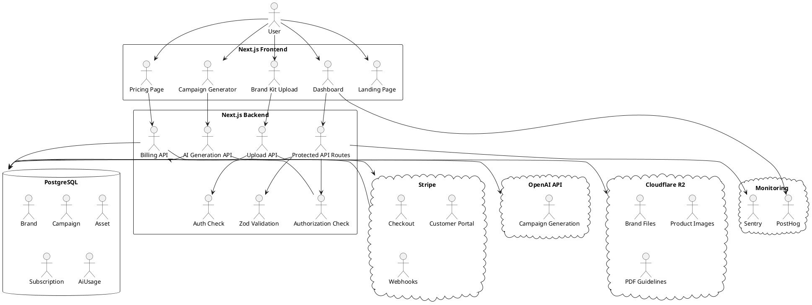

# Technical Architecture: ai-creativeops-studio

## 1. Overview

ai-creativeops-studio is a full-stack AI SaaS application for creative campaign generation.

The platform allows users to create a brand profile, upload brand assets, enter product and campaign details, generate AI-powered campaign ideas, and save results to a campaign library.

The MVP architecture is designed to be simple, scalable, and easy for contractors to implement.

## 2. Architecture Goals

- Build quickly with a single full-stack framework.
- Keep the architecture easy to deploy on Vercel.
- Use a relational database for users, brands, campaigns, subscriptions, and AI usage.
- Store uploaded brand files in object storage.
- Use structured AI output so campaign results are predictable.
- Support Stripe subscription billing from the beginning.
- Add basic monitoring and analytics for production visibility.
- Avoid over-engineering until the MVP is validated.

## 3. Recommended Stack

| Area | Technology |
|---|---|
| Frontend | Next.js App Router, TypeScript, Tailwind CSS, shadcn/ui |
| Backend | Next.js Route Handlers and Server Actions |
| Database | PostgreSQL |
| ORM | Prisma |
| Authentication | Auth.js |
| File Storage | Cloudflare R2 |
| AI Provider | OpenAI API |
| Payments | Stripe Checkout, Stripe Customer Portal, Stripe Webhooks |
| Deployment | Vercel |
| Error Monitoring | Sentry |
| Product Analytics | PostHog |

## 4. Frontend Architecture

The frontend will use Next.js App Router with TypeScript.

### Public Routes

- `/` - Landing page
- `/pricing` - Pricing page
- `/login` - Login page
- `/signup` - Signup page

### Authenticated Routes

- `/dashboard` - Main dashboard
- `/dashboard/brands` - Brand profiles and onboarding
- `/dashboard/campaigns` - Saved campaigns
- `/dashboard/campaigns/new` - AI campaign generator
- `/dashboard/settings` - User and billing settings

### Recommended App Router Structure

```txt
app/
  page.tsx
  pricing/
    page.tsx
  login/
    page.tsx
  signup/
    page.tsx
  dashboard/
    layout.tsx
    page.tsx
    brands/
      page.tsx
      new/
        page.tsx
      [id]/
        page.tsx
    campaigns/
      page.tsx
      new/
        page.tsx
      [id]/
        page.tsx
    settings/
      page.tsx
  api/
    me/
      route.ts
    brands/
      route.ts
      [id]/
        route.ts
    campaigns/
      route.ts
      [id]/
        route.ts
    ai/
      generate-campaign/
        route.ts
      generate-captions/
        route.ts
    uploads/
      route.ts
    stripe/
      checkout/
        route.ts
      customer-portal/
        route.ts
    webhooks/
      stripe/
        route.ts
```

### Frontend Responsibilities

- Render public marketing pages.
- Render authenticated dashboard pages.
- Collect brand onboarding information.
- Collect campaign generation input.
- Display AI-generated campaign outputs.
- Show saved campaigns.
- Surface loading, empty, and error states.
- Send authenticated requests to backend APIs.
- Track product analytics events through PostHog.

## 5. Reusable UI Architecture

Reusable UI should be organized by purpose, not randomly placed inside pages.

### Recommended Component Structure

```txt
components/
  ui/
    button.tsx
    card.tsx
    dialog.tsx
    input.tsx
    label.tsx
    select.tsx
    textarea.tsx
    toast.tsx
  layout/
    dashboard-sidebar.tsx
    dashboard-header.tsx
    dashboard-shell.tsx
    page-header.tsx
  brand/
    brand-form.tsx
    brand-card.tsx
    brand-kit-upload.tsx
    brand-summary.tsx
  campaign/
    campaign-form.tsx
    campaign-card.tsx
    campaign-output.tsx
    campaign-empty-state.tsx
    campaign-loading-state.tsx
  billing/
    pricing-card.tsx
    plan-badge.tsx
    usage-meter.tsx
  shared/
    error-message.tsx
    loading-spinner.tsx
    empty-state.tsx
```

### UI Design Rules

- Use shadcn/ui for accessible base components.
- Keep page files focused on routing and data loading.
- Keep forms reusable and validated with shared Zod schemas.
- Keep loading and error states consistent across the dashboard.
- Use Tailwind utility classes for styling.
- Use a luxury SaaS visual style suitable for fashion, beauty, jewelry, and lifestyle brands.

## 6. Backend Architecture

The backend will use Next.js Route Handlers for API endpoints and Server Actions for form mutations where appropriate.

Each backend request should follow this order:

1. Check authentication.
2. Validate request input with Zod.
3. Check authorization and ownership.
4. Perform the database operation through Prisma.
5. Return a typed JSON response.
6. Log important events when needed.

### Main API Routes

```txt
GET    /api/me

POST   /api/brands
GET    /api/brands
GET    /api/brands/:id
PATCH  /api/brands/:id
DELETE /api/brands/:id

POST   /api/campaigns
GET    /api/campaigns
GET    /api/campaigns/:id
PATCH  /api/campaigns/:id
DELETE /api/campaigns/:id

POST   /api/ai/generate-campaign
POST   /api/ai/generate-captions

POST   /api/uploads
DELETE /api/uploads/:id

POST   /api/stripe/checkout
POST   /api/stripe/customer-portal
POST   /api/webhooks/stripe
```

### Backend Library Structure

```txt
lib/
  auth.ts
  prisma.ts
  ai.ts
  stripe.ts
  storage.ts
  permissions.ts
  rate-limit.ts
  analytics.ts
  validators/
    brand.ts
    campaign.ts
    upload.ts
    billing.ts
```

### Backend Responsibilities

- Protect private API routes.
- Validate user input.
- Enforce user ownership.
- Manage database reads and writes.
- Generate AI campaign outputs.
- Track AI usage.
- Handle file uploads.
- Handle Stripe billing sessions and webhooks.
- Send product analytics events.
- Report production errors to Sentry.

## 7. Database Architecture

The MVP database will use PostgreSQL with Prisma.

### Core Models

- User
- Brand
- Campaign
- Asset
- Subscription
- AiUsage

### High-Level Relationships

```txt
User 1---many Brand
Brand 1---many Campaign
Brand 1---many Asset
User 1---1 Subscription
User 1---many AiUsage
```

### Model Plan

```prisma
model User {
  id               String         @id @default(cuid())
  email            String         @unique
  name             String?
  role             UserRole       @default(USER)
  stripeCustomerId String?
  brands           Brand[]
  subscription     Subscription?
  aiUsages         AiUsage[]
  createdAt        DateTime       @default(now())
  updatedAt        DateTime       @updatedAt
}

model Brand {
  id             String     @id @default(cuid())
  ownerId        String
  owner          User       @relation(fields: [ownerId], references: [id], onDelete: Cascade)
  name           String
  industry       String
  toneOfVoice    String?
  colors         String?
  fonts          String?
  targetAudience String?
  campaigns      Campaign[]
  assets         Asset[]
  createdAt      DateTime   @default(now())
  updatedAt      DateTime   @updatedAt

  @@index([ownerId])
}

model Campaign {
  id        String         @id @default(cuid())
  brandId   String
  brand     Brand          @relation(fields: [brandId], references: [id], onDelete: Cascade)
  title     String
  goal      String
  platform  CampaignPlatform
  status    CampaignStatus @default(DRAFT)
  aiOutput  Json
  createdAt DateTime       @default(now())
  updatedAt DateTime       @updatedAt

  @@index([brandId])
}

model Asset {
  id         String   @id @default(cuid())
  brandId    String
  brand      Brand    @relation(fields: [brandId], references: [id], onDelete: Cascade)
  fileName   String
  fileUrl    String
  fileType   String
  uploadedBy String
  createdAt  DateTime @default(now())

  @@index([brandId])
}

model Subscription {
  id                   String             @id @default(cuid())
  userId               String             @unique
  user                 User               @relation(fields: [userId], references: [id], onDelete: Cascade)
  stripeSubscriptionId String?
  plan                 SubscriptionPlan   @default(FREE)
  status               SubscriptionStatus @default(INACTIVE)
  currentPeriodEnd     DateTime?
  createdAt            DateTime           @default(now())
  updatedAt            DateTime           @updatedAt
}

model AiUsage {
  id         String   @id @default(cuid())
  userId     String
  user       User     @relation(fields: [userId], references: [id], onDelete: Cascade)
  actionType String
  tokensUsed Int?
  createdAt  DateTime @default(now())

  @@index([userId])
  @@index([createdAt])
}

enum UserRole {
  USER
  ADMIN
}

enum CampaignPlatform {
  INSTAGRAM
  TIKTOK
  EMAIL
  ADS
}

enum CampaignStatus {
  DRAFT
  GENERATED
  SAVED
  ARCHIVED
}

enum SubscriptionPlan {
  FREE
  PRO
  AGENCY
}

enum SubscriptionStatus {
  ACTIVE
  INACTIVE
  PAST_DUE
  CANCELED
}
```

### Database Notes

- The MVP should support single-user ownership first.
- Team collaboration can be added later using Organization, Membership, and Role models.
- `Campaign.aiOutput` should be JSON so the app can store structured campaign concepts, captions, hooks, image prompts, video ideas, and content calendar ideas.
- AI usage should be stored separately so plan limits can be enforced.

## 8. Authentication and Authorization

Auth.js will handle login, signup, and session management.

### Protected Routes

```txt
/dashboard/*
/api/brands/*
/api/campaigns/*
/api/ai/*
/api/uploads/*
/api/stripe/*
```

### MVP Authorization Rule

```txt
A user can only access brands, campaigns, assets, subscriptions, and AI usage records that belong to their own user account.
```

### Permission Checks

Every private request should check:

1. Is the user logged in?
2. Does the requested record exist?
3. Does the record belong to the current user?
4. Is the user allowed to perform this action?
5. Is the user's subscription plan allowed to use this feature?

### Future Roles

- Owner
- Admin
- Editor
- Viewer

These roles should be added after the MVP when team collaboration is introduced.

## 9. File Storage Architecture

Cloudflare R2 will store uploaded brand files.

### Supported Upload Types for MVP

- Logos
- Product images
- Brand guidelines
- PDF documents
- Reference images

### Upload Flow

```txt
User selects file
Frontend sends file metadata to API
API validates authentication
API validates ownership
API validates file type and file size
API uploads file to Cloudflare R2
API saves Asset record in PostgreSQL
User sees uploaded asset in the brand kit
```

### File Security Rules

- Files should not be publicly writable.
- Upload endpoints must validate file type and size.
- Users can only view files attached to brands they own.
- Use signed URLs or server-mediated access for private files.
- Store file metadata in the Asset table.
- Do not expose private user files across accounts.

## 10. AI Architecture

The AI module will live in:

```txt
lib/ai.ts
```

### Campaign Generation Endpoint

```txt
POST /api/ai/generate-campaign
```

### Input Shape

```ts
{
  brandId: string;
  productName: string;
  productDescription: string;
  campaignGoal: string;
  platform: "instagram" | "tiktok" | "email" | "ads";
  audience: string;
}
```

### Output Shape

```ts
{
  campaignTitle: string;
  campaignConcepts: string[];
  captions: string[];
  adHooks: string[];
  imagePrompts: string[];
  videoIdeas: string[];
  contentCalendarIdeas: string[];
}
```

### AI Generation Flow

```txt
User submits campaign form
API authenticates the user
API validates the request body
API loads the brand profile from the database
API checks that the user owns the brand
API checks subscription and AI usage limits
API builds a structured prompt
OpenAI generates structured JSON output
API validates the AI response
Campaign is saved to the database
AI usage is logged
Response is returned to the frontend
```

### AI Safety Rules

- Do not expose brand data between users.
- Validate all user inputs before building prompts.
- Keep prompts scoped to the selected brand.
- Log AI usage for billing and abuse prevention.
- Enforce rate limits on AI endpoints.
- Allow users to regenerate or edit outputs.

### Future RAG Flow

RAG is not required for the first MVP implementation, but the architecture should allow it later.

Future flow:

```txt
User uploads brand documents
Documents are parsed and chunked
Chunks are embedded and stored
When the user generates a campaign, relevant chunks are retrieved
AI uses the retrieved brand context to generate stronger outputs
```

## 11. Payments Architecture

Stripe will manage subscriptions.

### Billing Routes

```txt
POST /api/stripe/checkout
POST /api/stripe/customer-portal
POST /api/webhooks/stripe
```

### Billing Flow

```txt
User selects a plan
API creates a Stripe Checkout session
User completes checkout
Stripe sends webhook event
Webhook verifies Stripe signature
Subscription record is created or updated
User plan limits are updated
```

### Plans

- Free
- Pro
- Agency

### Billing Rules

- Free users receive limited AI generations.
- Pro users receive higher AI usage limits.
- Agency users receive the highest limits and future multi-brand features.
- Stripe webhooks are the source of truth for subscription status.
- The app should not upgrade a user until the Stripe webhook confirms payment.
- The Stripe Customer Portal should allow users to manage their subscription.

## 12. Monitoring and Analytics

### Sentry

Sentry will track:

- API errors
- AI generation failures
- Stripe webhook failures
- Upload errors
- Production exceptions

### PostHog

PostHog will track:

- Signups
- Brand creation
- Asset uploads
- Campaign generation
- Saved campaigns
- Subscription upgrades
- Feature usage

### Product Events

```txt
user_signed_up
brand_created
asset_uploaded
campaign_generated
campaign_saved
checkout_started
subscription_activated
```

### Why Monitoring Matters

Monitoring is important because this product depends on multiple external services: AI provider, storage provider, payment provider, and deployment platform. Errors should be visible quickly so production issues do not silently block users.

## 13. Deployment Architecture

The application will deploy to Vercel.

### Environments

```txt
Local
Preview
Production
```

### Required Environment Variables

```txt
DATABASE_URL
AUTH_SECRET
OPENAI_API_KEY
STRIPE_SECRET_KEY
STRIPE_WEBHOOK_SECRET
R2_ACCOUNT_ID
R2_ACCESS_KEY_ID
R2_SECRET_ACCESS_KEY
R2_BUCKET_NAME
SENTRY_DSN
NEXT_PUBLIC_POSTHOG_KEY
NEXT_PUBLIC_POSTHOG_HOST
```

### CI/CD Flow

```txt
Push to GitHub
Run linting
Run type checks
Run tests
Build project
Deploy preview or production on Vercel
```

### Deployment Rules

- `main` should represent production-ready code.
- Feature work should happen on branches.
- Pull requests should be reviewed before merging.
- Environment variables should not be committed to GitHub.
- `.env.example` should contain placeholders only.
- Preview deployments should be used to test changes before production.

## 14. System Flow

### High-Level System Flow

```txt
User
  -> Next.js Frontend
  -> Protected API Route
  -> Auth.js Session Check
  -> Zod Input Validation
  -> Authorization Check
  -> Prisma ORM
  -> PostgreSQL Database
```

### Campaign Generation System Flow

```txt
User
  -> Campaign Generator UI
  -> POST /api/ai/generate-campaign
  -> Auth Check
  -> Validate Input
  -> Load Brand
  -> Check Ownership
  -> Check Subscription Limits
  -> Build AI Prompt
  -> OpenAI API
  -> Validate AI Output
  -> Save Campaign
  -> Log AI Usage
  -> Return Generated Campaign
```

### Billing System Flow

```txt
User
  -> Pricing Page
  -> POST /api/stripe/checkout
  -> Stripe Checkout
  -> Stripe Webhook
  -> Verify Webhook Signature
  -> Update Subscription
  -> Unlock Plan Limits
```

### Upload System Flow

```txt
User
  -> Brand Kit Upload UI
  -> POST /api/uploads
  -> Auth Check
  -> Validate File
  -> Upload to Cloudflare R2
  -> Save Asset Metadata
  -> Display Asset in Dashboard
```

## 15. PlantUML System Diagram



## 16. MVP Architecture Decision Summary

The MVP will use a monolithic full-stack Next.js architecture.

This is the best fit for the first version because it keeps the frontend, backend, API routes, authentication, and deployment inside one application. It avoids unnecessary microservices while still allowing the product to scale later.

Future services, such as background AI processing, RAG document parsing, team collaboration, audit logs, and advanced analytics, can be added after the MVP is stable.

## 17. Cursor Instruction

Use this file as:

```txt
docs/technical-architecture.md
```

Cursor should create or update this file only for Ticket 2. It should not initialize the app, install dependencies, or write application code during this ticket.
